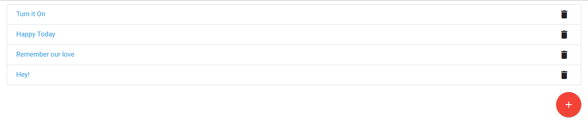
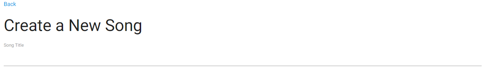
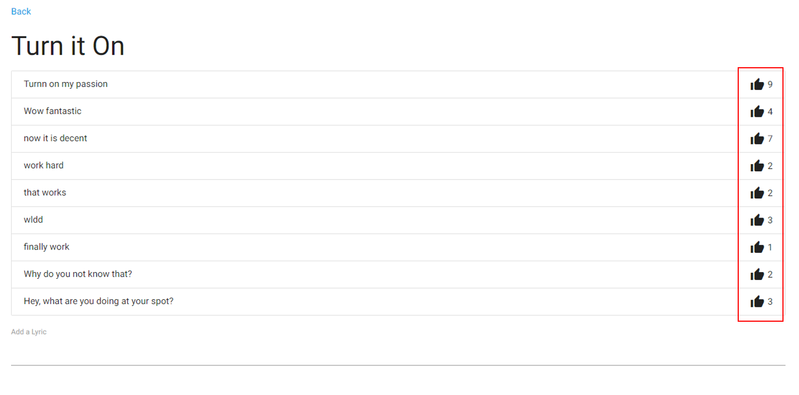
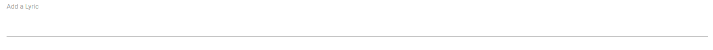

# Song's Best Lyric Contest

## Frontend : React
###  - Packages : apollo-boost, react-apollo, graphql, and react-router-dom
###  - css : materialized-css
## Backend : Node.js
###  - Packages : graphql, express-graphql, and express
## Database : mlab (MongoDB)

## Manual
### Clone or download applications
### Type "npm install" in terminals at both client and server directories  

## Application Concept :
#### Simple Lyric contest with a number of "likes"

## App Structure :
###
### 1. Song list contains all song lists fetched by a rootQuery 
### A song item can be deleted with a mutation working with "deleteOne()" in a GraphQL resolver.
##### 

### 2. Song creation contains a form to enter a song title
### The song title gets stored in MongoDB through a GrpahQL mutation
### Then the song data is immediately refetched to be updated in the client
##### 

### 3. Lyric list contains all lyric lists associated with a song 
### All lyrics are fetched on a basis of song id derived by props.params in the client 
### And then, the id is sent to the server through a query's input to find a song and its lyric list
### A song collection has a lyric array containing each lyric ObjectId through mongoose's ref method
### In order to get detail lyric documents in the song collection, populate() method is implemented
##### 

### 4. Lyric creation statys in a same page with the lyric list above
### Therefore, the new lyric data must be immediately updated
### In this app, props.data.refetch with promise is used. (componentDidUpdate can be used as well.)
### For the faster response from "likes" count mutation, optimisticResponse method is exploited.
##### 
